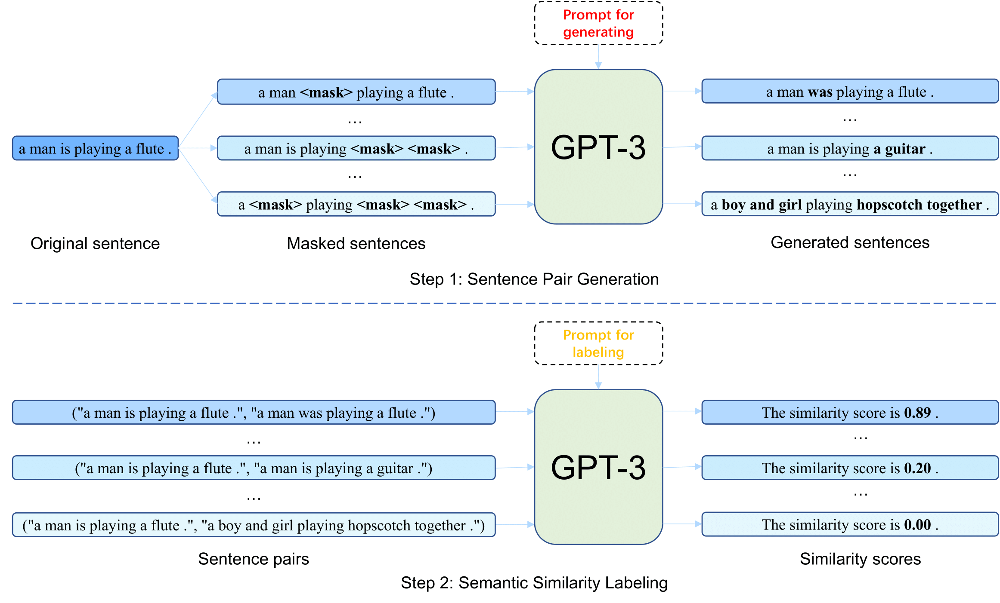

# Improving Contrastive Learning of Sentence Embeddings from AI Feedback

This repository contains the code, data and model checkpoints for our paper [Improving Contrastive Learning of Sentence Embeddings from AI
Feedback](https://arxiv.org/abs/2305.01918) (CLAIF).  
Accepted to Findings of ACL 2023.

## Preparing the Environment
```
conda create -n claif python=3.8
conda activate claif
pip install -r requirements.txt
```

## Data Generation
You can choose your own data as original sentences to construct datasets for sentence embeddings learning. Here we use a small set of sentences as an example to show the whole data generation process.  
We use **text-davinci-003** as the default engine.
### Overview

### Step 1: Sentence Pair Generation
```python
python data_generation.py --generation_stage stage-1 --output_dir sentence_pairs --input_file demo_sentences.csv --input_file_type stsb --batch_size 2 --openai_api_key <your_openai_api_key>
```
After step1, you will get sentence pairs in 'sentence_pairs/generated-dataset.jsonl' with a jsonl format.

### Step 2: Semantic Similarity Labeling
We use **text-davinci-003** as default.
```python
python data_generation.py --generation_stage stage-2 --output_dir sentence_pairs_with_labels --input_file ./sentence_pairs/generated-dataset.jsonl --input_file_type jsonl --batch_size 5 --openai_api_key <your_openai_api_key>
```
After step2, you will get sentence pairs with similarity scores and explainations from AI feedback in 'sentence_pairs_with_labels/generated-dataset.jsonl' with a jsonl format.

### Post Processing
We refer to the post-processing pipeline in dino: https://github.com/timoschick/dino/blob/main/scripts/sts/postprocess_dataset.py
```
python postprocess_dataset.py --input_file ./sentence_pairs_with_labels/generated-dataset.jsonl --output_file demo_sentence_pairs_post.jsonl
```
After post processing, you will get the final data 'demo_sentence_pairs_post.jsonl', which can be used for sentence embeddings learning.

### Generated Data
Here wo provide our generated data, which are used in our experiments: https://huggingface.co/datasets/fnlp/CLAIF-data  
**CLAIF**: claif_data.jsonl  
**CLAIF_scaled**: claif_scaled_data.jsonl  
**NLI_data_with_similarity_scores**: nli_data_with_similarity_scores.csv  

## Model Training

### Download Generated Data
```
cd generated_data
bash download_claif_data.sh
```

### Prepare STS Data
```
cd SentEval/data/downstream/
bash download_dataset.sh
```

### CLAIF
```python
python run_training.py \
--input_file ./generated_data/claif_data.jsonl \
--output_dir result_model \
--model_name roberta-base \
--num_epochs 3 \
--lr 2e-5 \
--using_stsb_dev
```
### CLHAIF
Coming soon.

## Evaluation
Coming soon.
